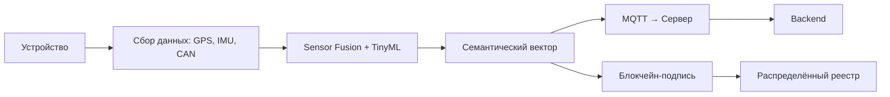
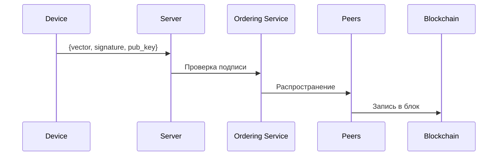
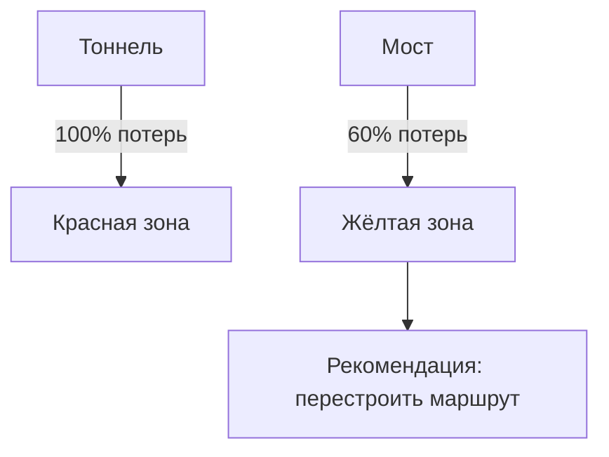
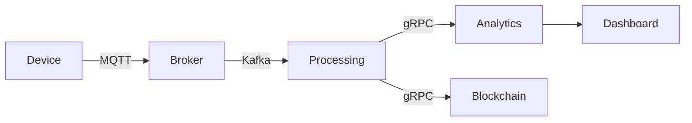

# 🚀 Умное телематическое устройство нового поколения  
### Семантический анализ движения, Edge AI и блокчейн-аудит  

*Готовое решение для повышения точности, безопасности и экономии*

---

## Слайд 1: Титульный слайд

**Заголовок:** Умное телематическое устройство  
**Подзаголовок:** От слежения к пониманию — семантический анализ движения на борту ТС  

> 🔑 Ключевое послание:  
> *«Ваши данные превращаются в прибыль прямо на борту транспортного средства»*

---

## Слайд 2: Проблемы традиционной телематики

❌ **Парадокс данных:** больше данных — меньше понимания  
❌ **Потери данных:** до 30% в "слепых зонах" (тоннели, города)  
❌ **Ложные алерты:** до 40% событий — ошибки  
❌ **Нет контекста:** GPS-точки без смысла  
❌ **Риски подделки:** данные не защищены  

> 💡 *По данным Deloitte (2023), 68% клиентов требуют 100% покрытия маршрута.*

---

## Слайд 3: Технические проблемы в реальных городах

- **Причина:** Глубокие эстакады и городские "каньоны"  
- **Последствия:** Разрывы трека до 5 минут  
- **Причина:** Электромагнитные помехи от ЖД  
- **Последствия:** «Дрожание» трека, ложные остановки  
- **Причина:** Металлические конструкции и ЛЭП  
- **Последствия:** Искажение времени в пути  

---

## Слайд 4: Сравнение систем

| Показатель        | Традиционная  | Edge AI                |
| ----------------- | ------------- | ---------------------- |
| Покрытие маршрута | 60–70%        | **95–98%**             |
| Точность в городе | 5–15 м        | **1–3 м**              |
| Тоннели           | Полная потеря | Непрерывный трек       |
| Контроль топлива  | Уровень бака  | Анализ расхода + сливы |
| Безопасность      | Нет защиты    | Блокчейн-верификация   |

---

## Слайд 5: Решение — семантический анализ движения

**Семантический анализ движения (САД)** — это переход от:
> `Где объект?` → `Что он делает, почему и с какими последствиями?`

**Преимущества:**
- События вместо точек: `ПОВОРОТ`, `РАЗГОН`, `СЛИВ ТОПЛИВА`
- Понимание контекста
- Автономность: работает без облака
- Защита: данные подписаны и неизменяемы

---

## Слайд 6: Пример структуры вектора движения (JSON)

```json
{
  "type": "LEFT_TURN",
  "course_start": 90,
  "course_end": 180,
  "speed_avg": 25,
  "distance": 120,
  "duration": 12,
  "radius": 8.5,
  "confidence": 0.92,
  "fuel_consumption": 1.2,
  "fuel_expected": 0.8,
  "fuel_anomaly": true,
  "timestamp": "2025-04-05T10:12:34Z",
  "device_id": "dev_789"
}
```

> 📌 **Пояснение полей:**  
> - `type`: тип маневра  
> - `confidence`: уверенность модели  
> - `fuel_anomaly`: отклонение от ожидаемого расхода  
> - `timestamp`: время события  

---

## Слайд 7: Как это работает? Архитектура



> ✅ Все вычисления — на устройстве  
> ✅ Данные шифруются и подписываются локально

---

## Слайд 8: Аппаратная платформа

| Компонент    | Спецификация                         |
| ------------ | ------------------------------------ |
| Процессор    | ESP32-U4WDH (Dual-core, 240 МГц)     |
| Память       | 8 МБ PSRAM + 16 МБ Flash             |
| Датчики      | 6-осевой IMU (MPU-6050), GPS/ГЛОНАСС |
| Связь        | 4G/LTE Cat-M1, LoRaWAN               |
| CAN          | Адаптер CAN-FD                       |
| Безопасность | Аппаратный TPM, ECDSA                |

> 💡 Подходит для установки на автобусы, грузовики, такси

---

## Слайд 9: Sensor Fusion — ядро точности

**Sensor Fusion** объединяет данные:
- GPS
- IMU (акселерометр + гироскоп)
- Одометр (CAN-шина)
- Магнитометр

**Алгоритм:** Фильтр Калмана  
- Динамически взвешивает данные
- При потере GPS — переход на **dead reckoning**

> 📊 Результат: точность 1–3 метра даже в подземных переходах

---

## Слайд 10: Работа в "слепых зонах"

```cpp
// При потере GPS
if (gps_quality < THRESHOLD) {
  position = kalman_filter.update(imu_data, odometer_data);
  // Dead Reckoning: позиция рассчитывается по ускорению и курсу
}
```

**Режимы:**
- GPS: основной источник
- IMU + одометр: резервный
- Автоматическое переключение

> ✅ Нет разрывов трека в тоннелях и подземках

---

## Слайд 11: Контроль топлива через семантику

**Формула ожидаемого расхода:**
```
fuel_expected = (distance * base_rate) + (elevation_gain * climb_factor) + (acceleration * dynamic_factor)
```

**Анализ:**
- Сравнение `fuel_consumption` vs `fuel_expected`
- При превышении — `fuel_anomaly = true`
- Генерация алерта о возможном сливе

> 💰 Экономия: до 25% от топливных затрат

---

## Слайд 12: Локальный ИИ (TinyML)

**7 встроенных моделей:**
1. Распознавание маневров (повороты, торможение)
2. Классификация стиля вождения
3. Прогноз поломок (по вибрации)
4. Обнаружение ДТП
5. Контроль погрузки/выгрузки
6. Распознавание остановок
7. Оценка состояния дороги

**Требования:** < 500 KB памяти  
**Фреймворк:** TensorFlow Lite Micro

---

## Слайд 13: Стиль вождения в реальном времени

```c
void detect_driving_style(IMUData data) {
  float jerk = abs(data.acceleration - prev_acceleration);
  if (jerk > JERK_THRESHOLD) {
    Vector event = create_vector("HARD_BRAKE", jerk);
    publish_vector(event);
  }
}
```

**Классификация:**
- Плавный
- Агрессивный
- Эко-вождение

> 📈 Результат: снижение износа на 18%, экономия топлива 12%

---

## Слайд 14: Блокчейн-верификация данных

**Зачем?**  
- Защита от подделки
- Юридическая значимость
- Аудит в спорах

**Процесс:**
1. Устройство генерирует хеш вектора
2. Подпись ECDSA на борту
3. Отправка на сервер
4. Проверка и запись в блокчейн

> 🔐 Неизменяемость, подлинность, доверие

---

## Слайд 15: Архитектура блокчейна



**Технология:** Hyperledger Fabric (приватный блокчейн)  
**Алгоритмы:** SHA-256, ECDSA  
**Пример подписи:** `0x7a3b8c...c9d2f1`

---

## Слайд 16: Пример данных в блокчейне

```json
{
  "tx_hash": "tx12345abcde",
  "data_hash": "sha256:abc123...",
  "device_id": "dev_789",
  "timestamp": "2025-04-05T10:12:34Z",
  "block_height": 14235,
  "verified": true
}
```

> ✅ Данные нельзя изменить задним числом  
> ✅ Доказательство в суде

---

## Слайд 17: Карта плохого приёма сигнала

**Сбор данных:**
- Устройство фиксирует: время, место, длительность потери GPS/GPRS
- Качество сигнала: HDOP, количество спутников, dBm

**Результат:** Тепловая карта проблемных зон

**Применение:**
- Оптимизация маршрутов
- Планирование инфраструктуры

---

## Слайд 18: Пример тепловой карты



> 🗺️ Данные обновляются каждые 24 часа

---

## Слайд 19: Протоколы передачи данных

### MQTT vs gRPC

| Параметр     | MQTT                    | gRPC                       |
| ------------ | ----------------------- | -------------------------- |
| Устройства   | ESP32, микроконтроллеры | Серверы, мощные устройства |
| Сеть         | GPRS, NB-IoT            | Стабильный интернет        |
| Данные       | JSON, небольшие         | Protobuf, потоковые        |
| Безопасность | TLS + сертификаты       | TLS + JWT                  |
| QoS          | Поддержка               | Нет                        |

---

## Слайд 20: Гибридная архитектура



**Рекомендация:**
- Устройства → MQTT
- Сервисы → gRPC

---

## Слайд 21: API и gRPC методы

```protobuf
service DeviceService {
  rpc SendRawSensorData (RawSensorData) returns (Ack);
  rpc SendMotionVector (MotionVector) returns (Ack);
  rpc VerifyData (VerifyRequest) returns (BlockchainReceipt);
}
```

---

## Слайд 22: Kafka — шина событий

**Топики:**
- `raw_sensor_data` — сырые данные
- `motion_vectors` — семантические векторы
- `alerts` — алерты
- `coverage_map` — карта покрытия

**Преимущества:**
- Буферизация
- Масштабируемость
- Асинхронная обработка

---

## Слайд 23: Бизнес-преимущества

| Преимущество            | Цифра   | Как получена    |
| ----------------------- | ------- | --------------- |
| Снижение потерь топлива | 20–25%  | Анализ аномалий |
| Точность в городе       | 1–3 м   | Sensor Fusion   |
| Окупаемость             | 4–6 мес | Расчёт ROI      |
| Покрытие маршрута       | 95–98%  | Dead Reckoning  |

---

## Слайд 24: Ограничения и пути развития

### Ограничения:
- Требует калибровки одометра
- IMU дрейфует при длительной работе
- TinyML требует переобучения

### Развитие:
- Интеграция V2X (машина-с-машиной)
- Автокалибровка по контрольным точкам
- Поддержка 5G и eSIM

> 📈 Gartner (2024): 90% ETA будут рассчитываться на edge-устройствах к 2026

---

## Слайд 25: Приимущества подхода

| Параметр          | Традиционная телематика | Edge AI           |
| ----------------- | ----------------------- | ----------------- |
| Точность в городе | 15–50 м                 | **1–3 м**         |
| Обработка         | Облако                  | **На устройстве** |
| Безопасность      | TLS                     | **Блокчейн**      |
| Оффлайн-работа    | Нет                     | **Полная**        |

---

## Слайд 26: Заключение

**Ключевые выводы:**
1. Традиционная телематика устарела — она не понимает, что происходит
2. Семантический анализ — это эволюция: от данных к смыслу
3. Edge AI, блокчейн и sensor fusion решают реальные проблемы

> 🎯 **Следующее поколение телематики уже здесь**

